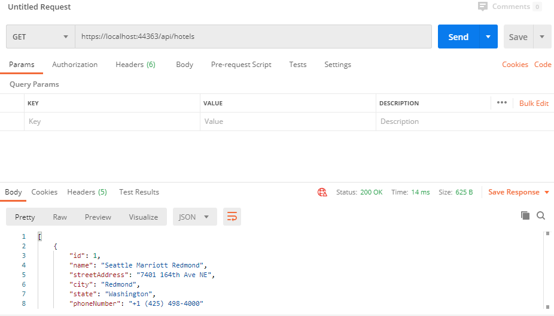
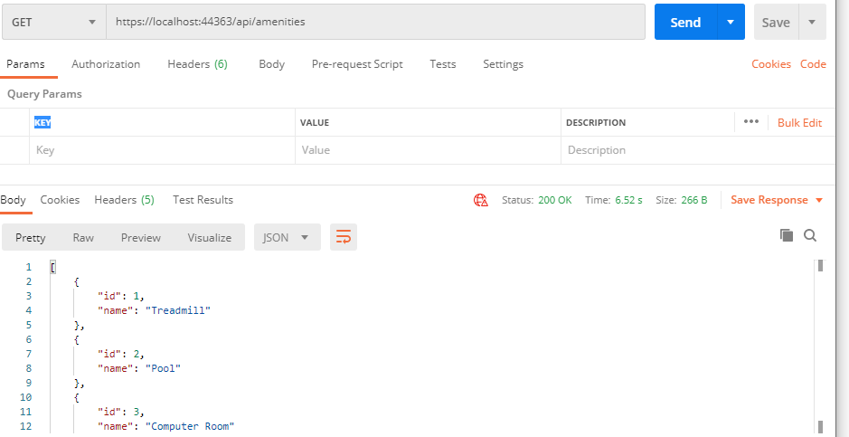
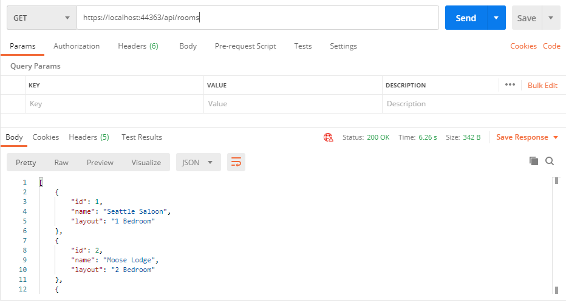
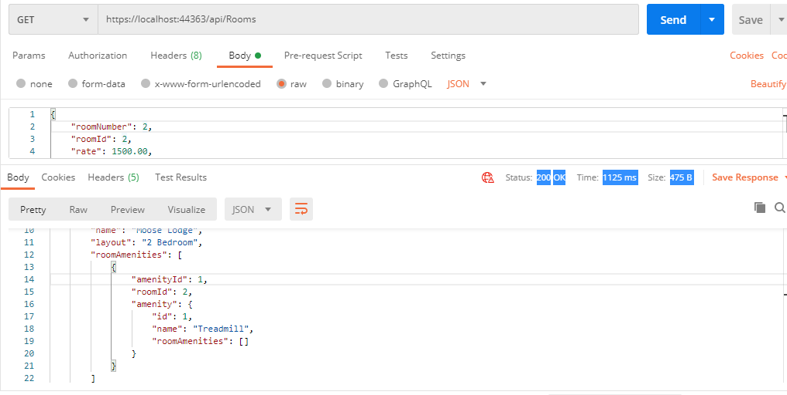

# EFCores and APIs
##### Lab12-EFCores and APIs
##### Lab13-Dependency Injection
##### Lab14-APIs & Controllers
##### Lab16-DTOs and Testing
##### Authors: Robert Carter, Paul Rest, Michael Refvem
##### Collaboration: Bryant Davis

### Description

##### This is a C# console application that creates a database with tables that can be both dynamically filled and hard coded
##### The initial creation for this app was the ERD, which outlined how the database will be structured. Primary, Foreign, and Composite keys were identified, as well as properties for each individual data point. 
##### This application is linked with the Postman app, which allows one to GET, POST, and PUT data on individual tables, be it Hotels, Rooms, or Amenities
##### This application was augmented to utilize dependency injections, which neccesitated the craetion of interfaces for each of the tables in the database, as well as repositories so that their data is saved off of the controller. 
##### The flow of information is now an interface interacts with both the controller and repository for a table, and grabs data from the repository upon request and sends it to the controller.
##### The ERD classes are linked via navigation properties. RoomAmenities, for example, is linked to both Room and Amenities. One can now add and subtract amenities from a room.
##### DTOs have been added to give information to the user while providing a level of security and privacy for information that they do not request or require.

#### Getting started

##### Clone this repository to your local machine.
###### $ git clone https://github.com/racarter1215/AsynchInnLab.git

### To run this application from VS:

##### Select File, then Open, then Project/Solution
##### Find the location of the cloned Repository
##### Select Async-Inn folder
##### Select Program.cs
##### Select the README.md

### Lab 11 ERD

### Lab 12 Postman

### Lab 13 Postman

### Lab 14 Postman

#### Change Log

###### 1.5: Application added DTOs for each part of the ERD - 27 July 2020
###### 1.4: Application added navigation properties between classes - 23 July 2020
###### 1.3: Application interface, controllers, and repositories added - 22 July 2020
###### 1.2: Application database and tables added - 21 July 2020
###### 1.1: Application first created - 20 July 2020
