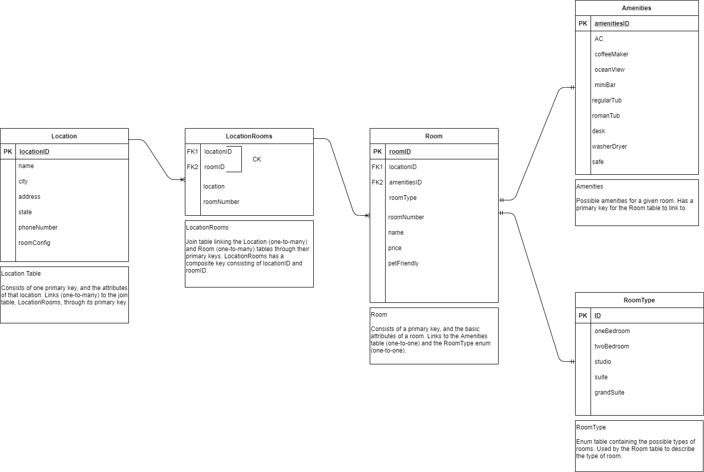

# Database and ERDs App
##### Lab11-Database and ERDs
##### Authors: Robert Carter, Paul Rest, Michael Refvem

### Description

##### This is a C# console application that utilized a Whiteboard to plan out a database
##### The initial creation for this app was the ERD, which outlined how the database will be structured. Primary, Foreign, and Composite keys were identified, as well as properties for each individual data point. 

#### Getting started

##### Clone this repository to your local machine.
###### $ git clone https://github.com/racarter1215/Async-Inn.git

### To run this application from VS:

##### Select File, then Open, then Project/Solution
##### Find the location of the cloned Repository
##### Select Async-Inn folder
##### Select the README.md

### Lab 11 ERD

#### Change Log

###### 1.1: Application first created - 20 July 2020
